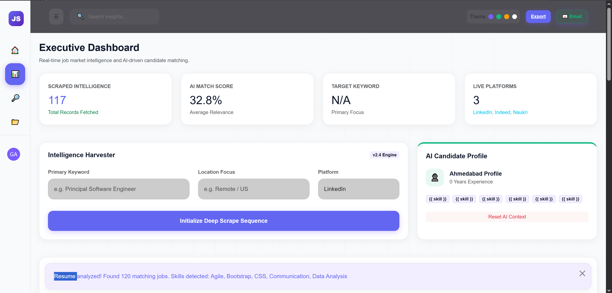

<div align="center">

# 🚀 Smart Job Manager

AI-powered job search platform — scrapes live listings from LinkedIn, Naukri & Indeed, parses your resume, and ranks every job with a **Smart Match Score**.

[](https://www.python.org/)
[](https://www.djangoproject.com/)
[](https://www.selenium.dev/)
[](https://spacy.io/)

</div>

---

## 📸 Preview

| Homepage | Dashboard |
|---|---|
|  |  |

<details>
<summary>More screenshots</summary>


</details>

---

## ✨ Features

- 🤖 **AI Match Scoring** — upload resume, get jobs ranked by relevance (skills, experience, location)
- 🕷️ **Multi-platform scraping** — 100+ live listings per search from LinkedIn, Indeed & Naukri
- 📄 **Resume parsing** — reads `.pdf` / `.docx`, extracts skills via NLP (spaCy)
- 📊 **Executive dashboard** — glassmorphism UI, tracks scraped data & match scores
- 🎨 **Theming** — Purple / Green / Gold / Light, saved per user

---

## 🛠️ Tech Stack

`Python` `Django 6.0` `Selenium` `BeautifulSoup` `spaCy` `Bootstrap 5` `SQLite`

---

## ⚙️ Run Locally

```bash
git clone https://github.com/your-username/job-scraper-platform.git
cd job-scraper-platform

python -m venv venv
source venv/bin/activate      # Windows: venv\Scripts\activate
pip install -r requirements.txt
python -m spacy download en_core_web_sm

python manage.py migrate
python manage.py runserver
```

Visit **http://127.0.0.1:8000**

> Requires [ChromeDriver](https://chromedriver.chromium.org/downloads) matching your Chrome version, added to PATH.

---

## 🚀 Roadmap

- LLM-based contextual resume-to-job matching
- Auto-apply for jobs scoring above 90%
- PostgreSQL migration for production

---

## 👨‍💻 Author

**Gautam Kumawat**

<div align="center">

**⭐ Star this repo if you found it useful!**

</div>