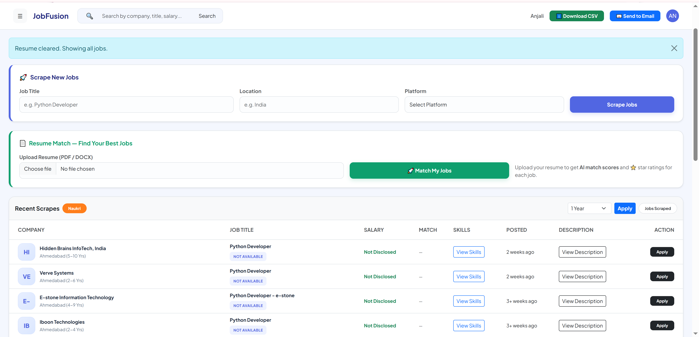
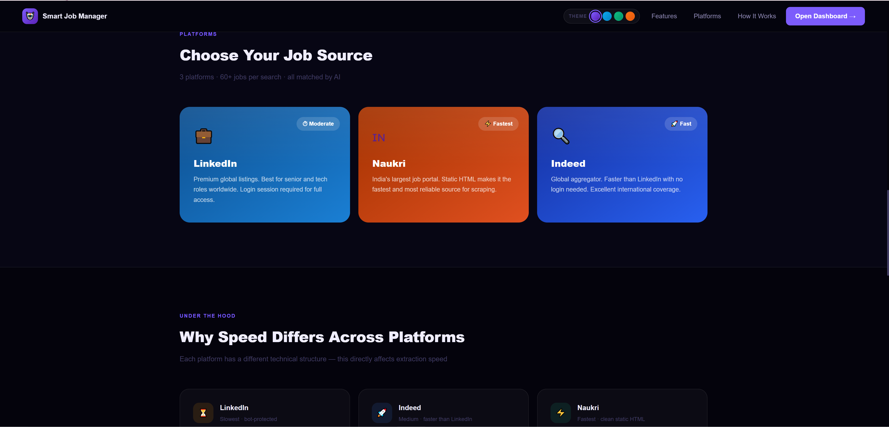

# 🚀 Smart Job Manager

A powerful **Django-based web application** that automatically scrapes job listings from multiple platforms and presents them in a clean, user-friendly dashboard for easy tracking and management.

---

## ✨ Features

* 🔍 Scrapes jobs from multiple platforms:

  * Indeed
  * LinkedIn
  * Naukri

* 📊 Clean and structured **Dashboard UI**

* 💾 Stores job data in database

* 📄 Basic **Resume Parsing** (keyword-based)

* ⚡ Automated job collection using Selenium

---

## 🛠️ Tech Stack

* **Backend:** Python, Django
* **Automation:** Selenium
* **Database:** SQLite
* **Frontend:** HTML, CSS, Bootstrap

---

## 📸 Screenshots

### 🏠 Homepage


### 📊 Dashboard



###  📊 Platform



---

## 📁 Project Structure

```
apps/
├── accounts        # Authentication (login/signup)
├── jobs            # Job data models & logic
├── dashboard       # Dashboard UI
├── scraping        # Scraping scripts
├── resume_parser   # Resume processing
```

---

## ⚙️ Setup Instructions

```bash
git clone https://github.com/your-username/job-scraper-platform.git
cd job-scraper-platform
pip install -r requirements.txt
python manage.py runserver
```

---

## ⚠️ Important Notes

* Sensitive files like `.env`, database, and logs are excluded from the repository
* ChromeDriver is not included — please install and configure it locally

---

## 💡 Future Improvements

* 🔐 Advanced authentication system
* 🤖 AI-based resume parsing
* 📧 Job alerts via email
* 📱 Responsive UI improvements

---

## 👨‍💻 Author

**Gautam Kumawat**

---

## ⭐ If you like this project

Give it a ⭐ on GitHub and feel free to contribute!
